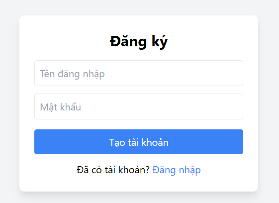
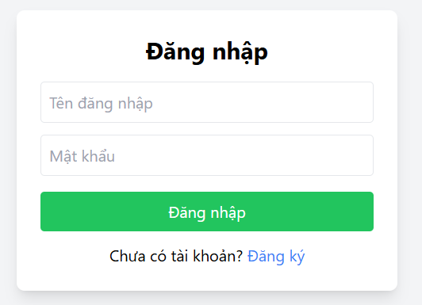
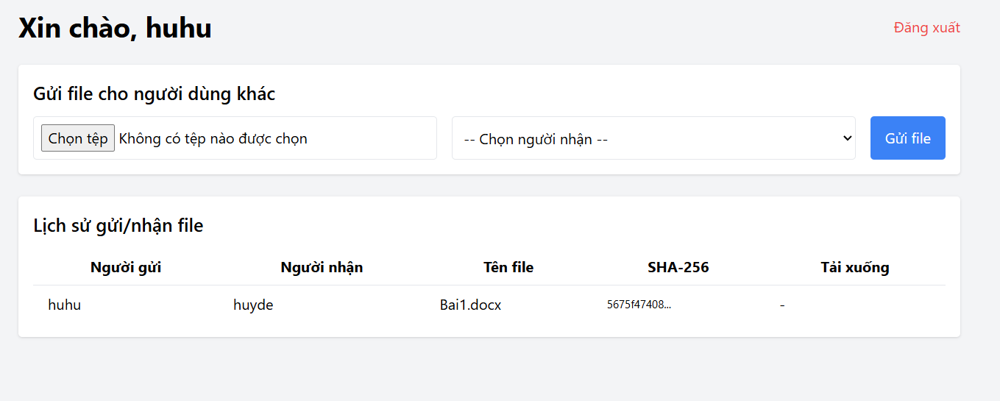

📁 Ứng dụng truyền file có kiểm tra tính toàn vẹn (SHA-256)

🌟 Mô tả

Ứng dụng web giúp người dùng đăng ký, đăng nhập và truyền file cho nhau thông qua socket, kèm theo việc kiểm tra tính toàn vẹn của file bằng thuật toán SHA-256. Giao diện đơn giản, đẹp và dễ sử dụng.

📊 Tính năng chính

🔐 Đăng ký / Đăng nhập / Đăng xuất người dùng

📂 Upload file từ máy tính và gửi cho user khác

🔍 Hiển thị lịch sử gửi/nhận file (ai gửi cho ai, file gì, mã SHA-256)

🚚 Tải file về từ server

⚡ Kiểm tra tính toàn vẹn file nhận được bằng SHA-256

👨‍💻 Công nghệ sử dụng

Flask (Python backend)

Socket (Truyền file trực tiếp giữa server - client)

HTML/CSS + Bootstrap (Giao diện)

SQLite (Lưu thông tin user và lịch sử gửi file)

🚀 Cách cài đặt và chạy

✅ 1. Cài thư viện cần thiết:

pip install -r requirements.txt

✉️ Nếu không có requirements.txt, chạy thủ công:

pip install flask flask_sqlalchemy werkzeug

✅ 2. Tạo thư mục nếu chưa có:

mkdir uploads downloads

✅ 3. Chạy socket server (ở 1 terminal khác):

python socket_server.py

✅ 4. Chạy Flask app:

python app.py

App chạy tại: http://127.0.0.1:5000

🔧 Cấu trúc thư mục

truyen-file-sha256/
├── app.py
├── socket_server.py
├── templates/
│   ├── login.html
│   ├── register.html
│   └── dashboard.html
├── static/
│   └── style.css
├── uploads/
├── downloads/
└── database.db

🚫 Lưu ý

Chỉ chạy được trên local (LAN nếu chỉnh IP socket)

Đảm bảo các file được lưu đúng thư mục

SHA-256 dùng để xác minh tính toàn vẹn sau khi nhận file

📄 Hình ảnh minh họa

🔑 Giao diện đăng ký

🔑 Giao diện đăng nhập

📊 Giao diện dashboard

📢 Đóng góp

Nếu bạn muốn đóng góp, hãy fork project và gửi pull request. Mọi đóng góp đều được hoan nghênh!

